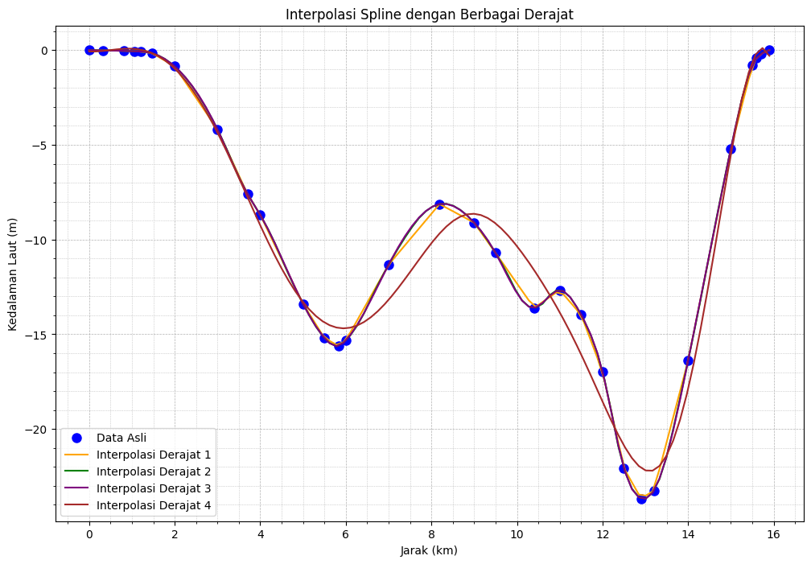

# 📊 Sea Depth Approximation Using Polynomial Spline Interpolation

This repository implements various polynomial spline interpolation techniques to approximate sea depth data between Teluk Suak and Pulau Lemukutan. The code explores linear, quadratic, cubic, and quartic splines, providing visualizations, error metrics, and interval-based polynomial equations for each spline degree.

## 🏞️ Dataset

The dataset used for this project represents the sea depth profile between **Teluk Suak** and **Pulau Lemukutan**. The depth data is approximated at various distance intervals. This study is based on the following journal:

**Reference**:  
Hariski, M., Kusumastuti, N., & Yudhi, Y. (2024). *Cubic Spline Interpolation to Approximate Sea Depth Between Teluk Suak and Lemukutan Island*. EPSILON: Jurnal Matematika Murni dan Terapan, 18(1), 1. [ResearchGate](https://www.researchgate.net/publication/384757784_CUBIC_SPLINE_INTERPOLATION_TO_APPROXIMATE_SEA_DEPTH_BETWEEN_TELUK_SUAK_AND_LEMUKUTAN_ISLAND)

## 💻 Features

- **Linear, Quadratic, Cubic, and Quartic Splines**: Supports multiple degrees of spline interpolation.
- **Error Metrics**: Calculates Mean Squared Error (MSE), Root Mean Squared Error (RMSE), Mean Absolute Error (MAE), and Mean Absolute Percentage Error (MAPE).
- **Interval-based Polynomial Equations**: Displays the piecewise equations for each interval for linear and cubic splines.
- **Visualizations**: Graphical comparison of the actual data with interpolated curves for each spline degree.

## 🧮 Methods

### 1. Linear Spline
- Piecewise linear approximation connecting each data point.
- Provides interval-based linear equations.
  
### 2. Quadratic Spline
- Fits quadratic polynomials between intervals.
- Due to the nature of quadratic splines, explicit equations are not provided.

### 3. Cubic Spline
- Popular for its smoothness, as it ensures continuity in the first and second derivatives.
- Provides interval-based cubic polynomial equations.

### 4. Quartic Spline
- A higher-order spline that attempts to reduce error by adding more degrees of freedom.
- Uses SciPy's `UnivariateSpline` with a degree of 4, but does not provide explicit interval equations.

## 📊 Results and Discussion

Each spline method's effectiveness was evaluated using the following metrics:

- **MSE (Mean Squared Error)**
- **RMSE (Root Mean Squared Error)**
- **MAE (Mean Absolute Error)**
- **MAPE (Mean Absolute Percentage Error)** (excludes data points with actual values of zero to avoid division errors)

The table below summarizes the performance of each spline degree:

| Spline Degree | MSE     | RMSE   | MAE    | MAPE    |
|---------------|---------|--------|--------|---------|
| Linear        | 0.0000  | 0.0000 | 0.0000 | 0.00%   |
| Quadratic     | 0.0462  | 0.2149 | 0.1439 | 2.87%   |
| Cubic         | 0.0515  | 0.2270 | 0.1513 | 3.02%   |
| Quartic       | 1.0796  | 1.0390 | 0.7895 | 22.15%  |

### 📈 Visualization

The following figure compares each spline's interpolated values with the actual sea depth data:

  

### 🔍 Analysis

- **Linear Spline**: Accurately captures the piecewise nature of the dataset but lacks smoothness, resulting in a sharp, angular approximation.
- **Quadratic Spline**: Provides a smoother fit than linear, reducing error metrics, but does not capture inflection points as effectively as cubic splines.
- **Cubic Spline**: The best-performing method in terms of smoothness and accuracy. It balances low error and continuity, making it ideal for this dataset.
- **Quartic Spline**: Although quartic splines offer a high degree of freedom, the results show overfitting with increased error. The high MAPE value suggests instability for this dataset.

## 📂 Code Structure

The code is organized as follows:

1. **Data Preparation**: Loads the distance (`data_x`) and depth (`data_y`) arrays.
2. **Spline Calculation and Evaluation**:
   - Computes spline interpolation for each degree.
   - Calculates interval-based polynomial equations for linear and cubic splines.
   - Computes error metrics and visualizes the results.
3. **Visualization**: Plots actual vs. interpolated values for each spline method, allowing easy comparison of fit quality.

## 📝 Usage

To reproduce the results, run the main script. Ensure `matplotlib`, `numpy`, `pandas`, and `scipy` are installed. The script will output tables for each spline degree with error metrics and display plots for visual analysis.

## 📚 References

- Hariski, M., Kusumastuti, N., & Yudhi, Y. (2024). *Cubic Spline Interpolation to Approximate Sea Depth Between Teluk Suak and Lemukutan Island*. EPSILON: Jurnal Matematika Murni dan Terapan, 18(1), 1. [ResearchGate](https://www.researchgate.net/publication/384757784_CUBIC_SPLINE_INTERPOLATION_TO_APPROXIMATE_SEA_DEPTH_BETWEEN_TELUK_SUAK_AND_LEMUKUTAN_ISLAND)
