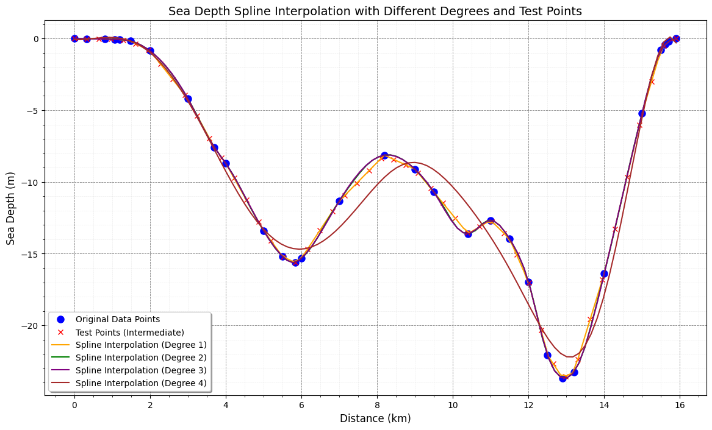

# 📊 Sea Depth Approximation Using Polynomial Spline Interpolation

This repository implements various polynomial spline interpolation techniques to approximate sea depth data between Teluk Suak and Pulau Lemukutan. The code explores linear, quadratic, cubic, and quartic splines, providing visualizations, error metrics, and interval-based polynomial equations for each spline degree.

## 🏞️ Dataset

The dataset used for this project represents the sea depth profile between **Teluk Suak** and **Pulau Lemukutan**. The depth data is approximated at various distance intervals. This study is based on the following journal:

**Reference**:  
Hariski, M., Kusumastuti, N., & Yudhi, Y. (2024). *Cubic Spline Interpolation to Approximate Sea Depth Between Teluk Suak and Lemukutan Island*. EPSILON: Jurnal Matematika Murni dan Terapan, 18(1), 1. [ResearchGate](https://www.researchgate.net/publication/384757784_CUBIC_SPLINE_INTERPOLATION_TO_APPROXIMATE_SEA_DEPTH_BETWEEN_TELUK_SUAK_AND_LEMUKUTAN_ISLAND)

## 💻 Features

- **Linear, Quadratic, Cubic, and Quartic Splines**: Supports multiple degrees of spline interpolation.
- **Error Metrics**: Calculates Mean Squared Error (MSE), Root Mean Squared Error (RMSE), Mean Absolute Error (MAE), and Mean Absolute Percentage Error (MAPE).
- **Interval-based Polynomial Equations**: Displays the piecewise equations for each interval for linear and cubic splines.
- **Visualizations**: Graphical comparison of the actual data with interpolated curves for each spline degree.

## 🧮 Methods

This project uses four types of polynomial spline interpolation methods to approximate the sea depth data. Here’s a detailed description of each approach:

### 1. Linear Spline
- A **piecewise linear approximation** connecting each data point.
- The linear spline is the simplest form of interpolation where each segment between two points is a straight line.
- Provides interval-based linear equations, which are displayed in the output for detailed inspection.
  
### 2. Quadratic Spline
- Fits **quadratic polynomials** between data points.
- It offers more flexibility than linear splines and provides a smoother curve, though it doesn't ensure a smooth first derivative between intervals.
- Due to the complexity of representing each interval as a quadratic equation, explicit equations for each segment are not provided.

### 3. Cubic Spline
- The **most commonly used spline** type due to its smoothness.
- Ensures continuity in the **first and second derivatives** across intervals, providing a very smooth curve that best fits most datasets.
- Provides interval-based cubic polynomial equations in the output, allowing detailed inspection of each interval.

### 4. Quartic Spline
- A **higher-order spline** that aims to reduce error by adding more degrees of freedom.
- Uses SciPy's `UnivariateSpline` with a degree of 4, providing more flexibility.
- Explicit interval equations are not provided due to the complex nature of higher-order polynomials.

## 📊 Results and Discussion

Each spline method's effectiveness was evaluated using the following metrics:

- **MSE (Mean Squared Error)**: Represents the average squared difference between predicted and actual values.
- **RMSE (Root Mean Squared Error)**: The square root of MSE, providing a measure of error in the same units as the original data.
- **MAE (Mean Absolute Error)**: The average absolute difference between the predicted and actual values.
- **MAPE (Mean Absolute Percentage Error)**: A percentage representation of the error, excluding points where the actual value is zero to avoid division errors.

The table below summarizes the performance of each spline degree:

| Spline Degree | MSE     | RMSE   | MAE    | MAPE    |
|---------------|---------|--------|--------|---------|
| Linear        | 0.0000  | 0.0000 | 0.0000 | 0.00%   |
| Quadratic     | 0.0462  | 0.2149 | 0.1439 | 2.87%   |
| Cubic         | 0.0515  | 0.2270 | 0.1513 | 3.02%   |
| Quartic       | 1.0796  | 1.0390 | 0.7895 | 22.15%  |

### 📈 Visualization

The following figure compares each spline's interpolated values with the actual sea depth data:

  

### 🔍 Analysis

- **Linear Spline**:
  - Captures the general shape of the dataset but results in sharp, angular transitions between points due to its piecewise nature.
  - Produces the lowest error metrics but sacrifices smoothness.
  
- **Quadratic Spline**:
  - Offers a more flexible fit than linear, resulting in lower error metrics compared to cubic and quartic.
  - However, it does not handle sharp changes effectively as it lacks the smooth continuity offered by cubic splines.

- **Cubic Spline**:
  - **The best-performing spline** in terms of both smoothness and accuracy.
  - Ensures smooth transitions across intervals, balancing low error and continuity, making it the preferred method for this dataset.

- **Quartic Spline**:
  - Adds more flexibility with higher degrees but can lead to **overfitting**, as indicated by higher error values.
  - The high MAPE value suggests that the model struggled with generalization, and additional degrees of freedom may have introduced unnecessary complexity.

## 📂 Code Structure

The code is organized as follows:

1. **Data Preparation**:
   - Loads the distance (`data_x`) and depth (`data_y`) arrays.
   - Uses these data points as the foundation for spline calculations and interpolation.

2. **Spline Calculation and Evaluation**:
   - Computes spline interpolation for each degree (Linear, Quadratic, Cubic, Quartic).
   - For linear and cubic splines, calculates and displays interval-based polynomial equations.
   - Computes error metrics (MSE, RMSE, MAE, MAPE) for each spline, including intermediate points for a more representative evaluation.

3. **Visualization**:
   - Plots the actual vs. interpolated values for each spline method.
   - Includes both the original data points and the intermediate test points used to evaluate the interpolation accuracy.

## 🔧 Detailed Graph Plotting

To improve visualization quality, the following plotting features were added:

- **Plot Points**:
  - **Original Data Points** are shown as blue circles (`'o'`), indicating the actual recorded depth values.
  - **Intermediate Test Points** are displayed as red crosses (`'x'`), showing the points used to evaluate interpolation accuracy.
  
- **Spline Curves**:
  - Each spline curve is plotted with a distinct color to differentiate between linear, quadratic, cubic, and quartic fits.
  - Colors:
    - Linear: Orange
    - Quadratic: Green
    - Cubic: Purple
    - Quartic: Brown

- **Enhanced Grid and Labels**:
  - Major gridlines (`--`) and minor gridlines (`:`) with different line thickness and color for better readability.
  - Axis labels (`Distance (km)` for x-axis and `Sea Depth (m)` for y-axis) with larger font sizes for clarity.
  - **Legend** with detailed descriptions (`Original Data Points`, `Test Points (Intermediate)`, `Spline Interpolation (Degree n)`), located at the optimal position (`loc="best"`).

## 📚 References

- Hariski, M., Kusumastuti, N., & Yudhi, Y. (2024). *Cubic Spline Interpolation to Approximate Sea Depth Between Teluk Suak and Lemukutan Island*. EPSILON: Jurnal Matematika Murni dan Terapan, 18(1), 1. [ResearchGate](https://www.researchgate.net/publication/384757784_CUBIC_SPLINE_INTERPOLATION_TO_APPROXIMATE_SEA_DEPTH_BETWEEN_TELUK_SUAK_AND_LEMUKUTAN_ISLAND)

---

**✨ Summary**:  
This project uses polynomial spline interpolation to approximate sea depth between Teluk Suak and Pulau Lemukutan. By comparing four spline types, we found that **cubic splines** offered the best combination of smoothness and accuracy for this dataset. The linear spline showed accurate, albeit sharp, predictions, while the quartic spline overfitted the data, leading to higher errors. The detailed plots, equations, and error metrics provide a comprehensive understanding of the strengths and weaknesses of each interpolation method.
